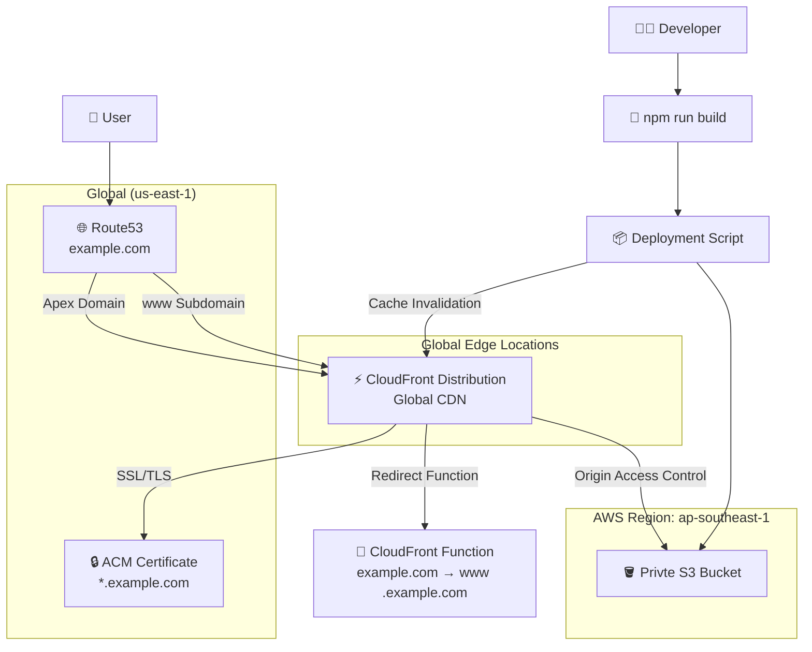

# 🚀 AWS Static Website Hosting with Terraform

A sample of an infrastructure-as-code solution for hosting static websites on AWS using S3, CloudFront, Route53, and ACM certificates. This project demonstrates modern cloud architecture best practices with automated deployment workflows.


## 🏗️ Architecture Overview


### Core Infrastructure
- **🪣 Amazon S3:** Private bucket for static file storage
- **⚡ CloudFront CDN:** Global content distribution with edge caching
- **🔒 ACM (Certificate Manager):** Free SSL/TLS certificates
- **🌐 Route53:** DNS management and domain routing
- **🔄 Origin Access Control (OAC):** Secure S3-CloudFront integration

### Key Features
- ✅ **Private S3 Bucket:** No direct public access, CloudFront-only
- ✅ **Global CDN:** Fast content delivery worldwide
- ✅ **Custom Domain:** example.com with www redirect
- ✅ **SSL/HTTPS:** Free certificates with auto-renewal
- ✅ **SPA Support:** Client-side routing for React apps
- ✅ **Cache Optimization:** Intelligent caching strategies by file type
- ✅ **Automated Deployment:** One-command deploy with cache invalidation

## 📊 Infrastructure Diagram



## 🛠️ Technology Stack

### Infrastructure
- **Terraform:** Infrastructure as Code
- **AWS CLI:** Cloud resource management
- **Node.js:** Build and deployment scripts

### AWS Services
| Service | Purpose | Configuration |
|---------|---------|---------------|
| S3 | Static file hosting | Private bucket with versioning |
| CloudFront | CDN distribution | Global edge locations, custom domains |
| Route53 | DNS management | Hosted zone with A/AAAA records |
| ACM | SSL certificates | Multi-domain cert (example.com, www.example.com) |
| OAC | Secure access | CloudFront-only S3 access |

## 🚀 Quick Start

### Prerequisites
- AWS CLI configured with appropriate permissions
- Terraform >= 1.0
- Node.js >= 18
- Domain ownership (for custom domain setup)

### 1. Clone and Setup
```bash
git clone <repository-url>
cd s3-static-hosting
```

### 2. Configure Domain
```bash
cd terraform
cp terraform.tfvars.example terraform.tfvars
# Edit terraform.tfvars with your domain name
```

### 3. Deploy Infrastructure
```bash
terraform init
terraform plan
terraform apply
```

### 4. Update Domain Nameservers
After terraform apply completes, update your domain registrar with the provided Route53 nameservers.

### 5. Deploy Website
```bash
# Full deployment workflow
./scripts/build-and-deploy.sh

# Or quick deploy from static-fe/
cd static-fe
npm run deploy
```

## 📁 Project Structure

```
s3-static-hosting/
├── 📋 README.md                    # This comprehensive guide
├── 🏗️ terraform/                  # Infrastructure as Code
│   ├── main.tf                     # Main Terraform configuration
│   ├── variables.tf                # Input variables
│   ├── outputs.tf                  # Output values
│   ├── terraform.tfvars.example    # Configuration template
│   └── modules/                    # Reusable Terraform modules
│       ├── s3/                     # S3 bucket configuration
│       ├── cloudfront/             # CDN distribution setup
│       └── route53/                # DNS management
├── 🚀 scripts/                    # Deployment automation
│   ├── deploy.js                   # Node.js deployment script
│   └── build-and-deploy.sh         # Complete workflow script
└── 🌐 static-fe/                  # React frontend application
    ├── src/                        # Source code
    ├── dist/                       # Built files (generated)
    ├── package.json                # Dependencies and scripts
    └── vite.config.js              # Build configuration
```

## 🔧 Deployment Commands

### Development Workflow
```bash
# Install dependencies
cd static-fe && npm install

# Start development server
npm run dev

# Run linting
npm run lint

# Build for production
npm run build

# Preview production build
npm run preview
```

### Deployment Options

#### 1. Full Automated Workflow
```bash
# Complete build and deploy process
./scripts/build-and-deploy.sh

# Dry run (preview changes)
./scripts/build-and-deploy.sh --dry-run
```

#### 2. Quick Deploy (from static-fe/)
```bash
# Build and deploy
npm run deploy

# Dry run preview
npm run deploy:dry-run
```

#### 3. Manual Deployment
```bash
# Build the app
cd static-fe && npm run build

# Sync to S3 (replace with your bucket name)
aws s3 sync ./static-fe/dist/ s3://YOUR_BUCKET_NAME/ --delete

# Invalidate CloudFront cache (replace with your distribution ID)
aws cloudfront create-invalidation --distribution-id YOUR_DISTRIBUTION_ID --paths "/*"
```

## ⚙️ Configuration

### Terraform Variables
Key configuration options in `terraform/terraform.tfvars`:

```hcl
# Required: Your domain name
domain_name = "example.com"

# Optional: AWS region (default: ap-southeast-1)
aws_region = "ap-southeast-1"

# Optional: Environment (default: prod)
environment = "prod"

# Optional: CloudFront settings
cloudfront_price_class = "PriceClass_100"  # US, Canada, Europe
enable_ipv6 = true
minimum_protocol_version = "TLSv1.2_2021"

# Optional: Cache behavior
cache_behavior_settings = {
  default_ttl = 86400    # 1 day
  max_ttl     = 31536000 # 1 year
  min_ttl     = 0
}
```

### Deployment Configuration
The deployment script automatically uses these settings (example values):
- **S3 Bucket:** `your-domain-website-prod` 
- **CloudFront Distribution:** `YOUR_DISTRIBUTION_ID`
- **Region:** `your-preferred-region`

## 🔄 Caching Strategy

### File Type Optimization
| File Type | Cache Duration | Compression |
|-----------|----------------|-------------|
| HTML | 1 day | Enabled |
| CSS | 1 year | Enabled |
| JavaScript | 1 year | Enabled |
| Images (PNG/JPG) | 1 year | Disabled |
| SVG | 1 year | Enabled |

### Cache Invalidation
- Automatic invalidation after each deployment
- Manual invalidation: `npm run deploy` handles this
- CloudFront invalidation typically takes 10-15 minutes

## 🛡️ Security Features

### S3 Security
- ✅ Private bucket (no public access)
- ✅ Bucket policy restricts access to CloudFront only
- ✅ Server-side encryption (AES256)
- ✅ Versioning enabled for rollback capability

### CloudFront Security
- ✅ Origin Access Control (OAC) for S3 access
- ✅ HTTPS redirect (all HTTP → HTTPS)
- ✅ TLS 1.2+ minimum protocol
- ✅ Custom domain SSL certificates

### DNS Security
- ✅ Route53 hosted zone with DNSSEC support
- ✅ A and AAAA records for IPv4/IPv6
- ✅ Proper SPF/DMARC preparation for future email

## 📈 Monitoring & Management


### DNS Verification Commands
```bash
# Check nameservers
dig NS example.com

# Verify domain resolution
dig A www.example.com
dig A example.com

# SSL certificate check
openssl s_client -connect www.example.com:443 -servername www.example.com
```

## 🔧 Troubleshooting

### Common Issues

#### 1. Domain Not Resolving
- Verify nameservers are updated at your registrar
- DNS propagation can take up to 48 hours
- Test with: `dig @8.8.8.8 NS example.com`

#### 2. SSL Certificate Issues
- Ensure certificate is validated via DNS
- Check ACM console for validation status
- Certificate must be in us-east-1 for CloudFront

#### 3. CloudFront Access Denied
- Verify Origin Access Control configuration
- Check S3 bucket policy allows CloudFront access
- Ensure using regional S3 domain name

#### 4. Deployment Issues
- Verify AWS credentials: `aws sts get-caller-identity`
- Check build directory exists: `ls static-fe/dist/`
- Confirm S3 bucket permissions

### Debug Commands
```bash
# Test deployment without changes
./scripts/build-and-deploy.sh --dry-run

# Check AWS credentials
aws sts get-caller-identity

# Verify S3 bucket contents (replace with your bucket name)
aws s3 ls s3://YOUR_BUCKET_NAME/

# Check CloudFront distribution status (replace with your distribution ID)
aws cloudfront get-distribution --id YOUR_DISTRIBUTION_ID --query 'Distribution.Status'
```

## 🔒 Security Best Practices

### Information Security in Documentation
When sharing this project or creating documentation:

**✅ Safe to Share:**
- CloudFront distribution domain (e.g., `d123456.cloudfront.net`) - publicly accessible
- S3 bucket names - if buckets are properly secured with private access
- Terraform configuration patterns and structures
- Architecture diagrams and workflows

**⚠️ Keep Private:**
- AWS account IDs (visible in some ARNs)
- IAM user credentials or keys
- Terraform state files (contain sensitive data)
- AWS Console direct links (contain account-specific information)

**🛡️ Repository Security:**
- Add `terraform.tfvars` to `.gitignore` (contains sensitive config)
- Never commit AWS credentials or keys
- Use environment variables or AWS profiles for authentication
- Keep `terraform.tfstate` files secure (consider remote state)

### Infrastructure Security
This project implements security best practices:
- Private S3 bucket with CloudFront-only access
- Origin Access Control (OAC) instead of legacy Origin Access Identity
- HTTPS enforcement and TLS 1.2+ minimum
- Server-side encryption for S3 objects
- Proper IAM policies with least privilege access

## Resource Creation Overview
View the [RESOURCE_CREATION_OVERVIEW.md](RESOURCE_CREATION_OVERVIEW.md) file for a detailed overview of the resources created by this Terraform project.

## 📄 License

This project is open source and available under the [MIT License](LICENSE).
