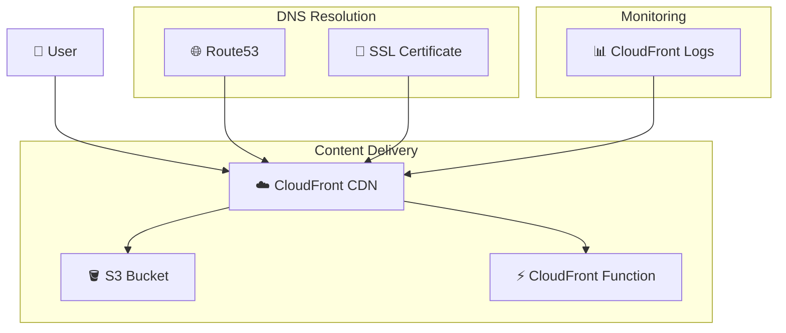
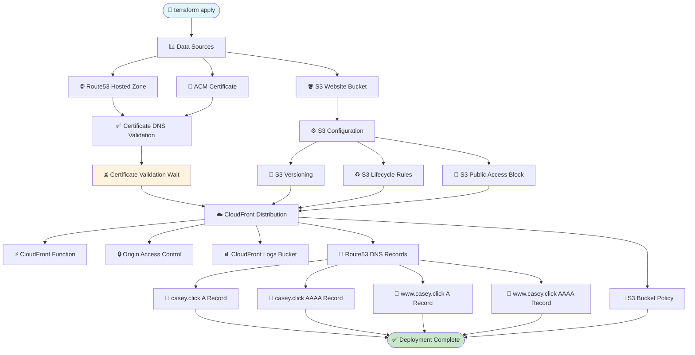
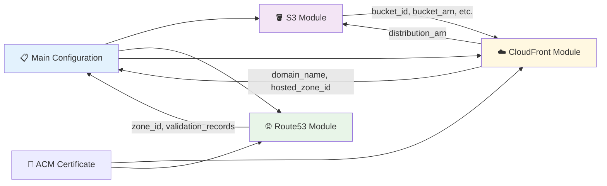
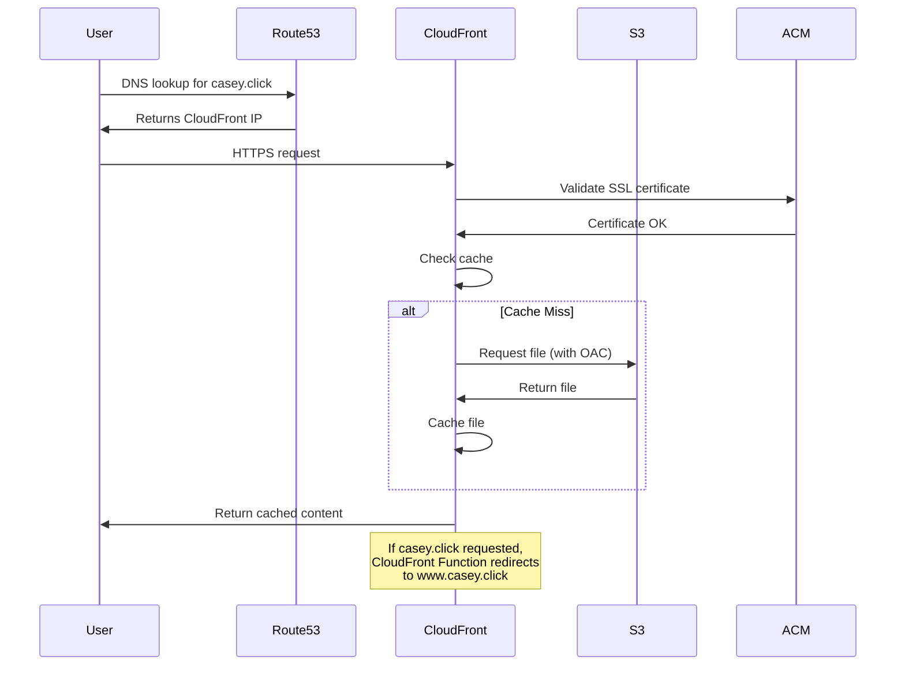

# AWS Static Website - Resource Creation Overview

This document provides a comprehensive overview of all AWS resources created by this Terraform project and their creation flow for the `casey.click` static website.

## Table of Contents
- [Architecture Overview](#architecture-overview)
- [Resource Creation Flow](#resource-creation-flow)
- [Detailed Resource Breakdown](#detailed-resource-breakdown)
- [Module Dependencies](#module-dependencies)
- [Deployment Sequence](#deployment-sequence)
- [Troubleshooting Guide](#troubleshooting-guide)

## Architecture Overview

This project creates a secure, scalable static website infrastructure using AWS services:



## Resource Creation Flow

The following diagram shows the complete resource creation sequence and dependencies:



## Detailed Resource Breakdown

### Core Infrastructure (Main Configuration)

| Resource | Type | Purpose | Dependencies |
|----------|------|---------|--------------|
| **Data Sources** | `aws_caller_identity`, `aws_region` | Account and region info | None |
| **AWS Providers** | `aws` (2 instances) | Main region + us-east-1 for ACM | None |

### SSL/TLS Certificate Resources

| Resource | Type | Purpose | Dependencies |
|----------|------|---------|--------------|
| **ACM Certificate** | `aws_acm_certificate` | SSL certificate for domains | None |
| **Certificate Validation** | `aws_acm_certificate_validation` | Validates certificate via DNS | Route53 module, ACM certificate |

### DNS Resources (Route53 Module)

| Resource | Type | Purpose | Dependencies |
|----------|------|---------|--------------|
| **Hosted Zone** | `aws_route53_zone` | DNS zone for casey.click | None |
| **Cert Validation Records** | `aws_route53_record` | DNS validation for SSL | Hosted zone, ACM certificate |
| **Health Check** | `aws_route53_health_check` | Website health monitoring | None (optional) |

### Storage Resources (S3 Module)

| Resource | Type | Purpose | Dependencies |
|----------|------|---------|--------------|
| **Website Bucket** | `aws_s3_bucket` | Stores static website files | None |
| **Bucket Versioning** | `aws_s3_bucket_versioning` | File version control | S3 bucket |
| **Lifecycle Rules** | `aws_s3_bucket_lifecycle_configuration` | Manages old file versions | S3 bucket |
| **Public Access Block** | `aws_s3_bucket_public_access_block` | Security - blocks public access | S3 bucket |
| **Server Side Encryption** | `aws_s3_bucket_server_side_encryption_configuration` | Encrypts stored files | S3 bucket |
| **Notification** | `aws_s3_bucket_notification` | Triggers on file changes | S3 bucket, CloudFront |

### CDN Resources (CloudFront Module)

| Resource | Type | Purpose | Dependencies |
|----------|------|---------|--------------|
| **Origin Access Control** | `aws_cloudfront_origin_access_control` | Secure S3 access | None |
| **CloudFront Function** | `aws_cloudfront_function` | Redirects apex → www | None |
| **CloudFront Distribution** | `aws_cloudfront_distribution` | CDN for global content delivery | OAC, Function, Certificate validation |
| **Logs Bucket** | `aws_s3_bucket` | Stores access logs | None (optional) |
| **Logs Lifecycle** | `aws_s3_bucket_lifecycle_configuration` | Manages log retention | Logs bucket |

### DNS Records (Main Configuration)

| Resource | Type | Purpose | Dependencies |
|----------|------|---------|--------------|
| **www A Record** | `aws_route53_record` | Points www.casey.click to CloudFront | CloudFront, Route53 zone |
| **www AAAA Record** | `aws_route53_record` | IPv6 for www.casey.click | CloudFront, Route53 zone |
| **Apex A Record** | `aws_route53_record` | Points casey.click to CloudFront | CloudFront, Route53 zone |
| **Apex AAAA Record** | `aws_route53_record` | IPv6 for casey.click | CloudFront, Route53 zone |

### Security Resources (Main Configuration)

| Resource | Type | Purpose | Dependencies |
|----------|------|---------|--------------|
| **S3 Bucket Policy** | `aws_s3_bucket_policy` | Allows CloudFront access to S3 | CloudFront, S3 module |

## Module Dependencies



## Deployment Sequence

### Phase 1: Foundation (Parallel)
- ✅ Data sources collection
- ✅ Route53 hosted zone creation
- ✅ S3 bucket creation
- ✅ ACM certificate request

### Phase 2: Configuration (Parallel)
- ✅ S3 bucket configuration (versioning, lifecycle, encryption)
- ✅ Certificate DNS validation records
- ✅ CloudFront function creation
- ✅ Origin Access Control creation

### Phase 3: Validation (Sequential)
- ⏳ Wait for certificate DNS validation (up to 10 minutes)
- ✅ Certificate validation completion

### Phase 4: CDN Setup (Sequential)
- ✅ CloudFront distribution creation (depends on certificate validation)
- ✅ CloudFront logs bucket (if enabled)

### Phase 5: Final DNS (Sequential)
- ✅ Route53 DNS records pointing to CloudFront
- ✅ S3 bucket policy allowing CloudFront access

### Typical Deployment Timeline
- **Phase 1-2**: ~2-3 minutes
- **Phase 3**: ~5-10 minutes (certificate validation)
- **Phase 4**: ~10-15 minutes (CloudFront distribution)
- **Phase 5**: ~1-2 minutes
- **Total**: ~18-30 minutes

## Resource Communication Flow



## Key Configuration Details

### SSL/TLS Configuration
- **Certificate**: ACM certificate for `casey.click` and `www.casey.click`
- **Validation**: DNS validation via Route53
- **Protocol**: TLS 1.2 minimum (configurable)
- **SNI**: Server Name Indication enabled

### CloudFront Configuration
- **Origins**: S3 bucket via Origin Access Control
- **Behaviors**: Default + file-type specific caching
- **Function**: Apex domain redirect (casey.click → www.casey.click)
- **Caching**: 1 day default, 1 year max, customizable
- **Compression**: Enabled
- **IPv6**: Enabled by default

### S3 Configuration
- **Versioning**: Enabled
- **Encryption**: AES-256 server-side encryption
- **Public Access**: Blocked (access only via CloudFront)
- **Lifecycle**: Deletes old versions after 30 days

### Route53 Configuration
- **Hosted Zone**: Authoritative DNS for casey.click
- **Records**: A and AAAA records for both apex and www
- **Health Check**: Optional HTTPS health monitoring
- **TTL**: 60 seconds for validation records

## Troubleshooting Guide

### Common Issues and Solutions

#### 1. Certificate Validation Timeout
**Symptoms**: Certificate validation fails after 10 minutes
**Causes**: 
- DNS records not propagated
- Incorrect nameservers at domain registrar
**Solutions**:
```bash
# Check nameservers
dig NS casey.click

# Check validation records
dig _acme-challenge.casey.click TXT
dig _acme-challenge.www.casey.click TXT
```

#### 2. CloudFront Distribution Creation Fails
**Symptoms**: CloudFront resource creation error
**Causes**:
- Certificate not validated
- Invalid origin configuration
**Solutions**:
- Wait for certificate validation to complete
- Check S3 bucket exists and is accessible

#### 3. DNS Records Not Resolving
**Symptoms**: Domain doesn't resolve to CloudFront
**Causes**:
- Nameservers not updated at registrar
- DNS propagation delay
**Solutions**:
```bash
# Check current nameservers
dig NS casey.click

# Test resolution
dig casey.click
dig www.casey.click
```

#### 4. S3 Access Denied
**Symptoms**: CloudFront can't access S3 content
**Causes**:
- Missing bucket policy
- Incorrect Origin Access Control
**Solutions**:
- Verify S3 bucket policy allows CloudFront access
- Check Origin Access Control configuration

### Useful Commands

```bash
# Check Terraform state
terraform state list
terraform state show aws_cloudfront_distribution.website

# Test website
curl -I https://www.casey.click
curl -I https://casey.click

# Check SSL certificate
openssl s_client -connect www.casey.click:443 -servername www.casey.click

# CloudFront cache invalidation
aws cloudfront create-invalidation --distribution-id E1234567890ABC --paths "/*"

# Check DNS propagation
dig +trace casey.click
nslookup casey.click 8.8.8.8
```

## Security Features

### Implemented Security Measures
- ✅ **Origin Access Control**: S3 bucket only accessible via CloudFront
- ✅ **SSL/TLS Encryption**: HTTPS enforced with modern TLS versions
- ✅ **S3 Public Access Block**: Prevents accidental public exposure
- ✅ **Server-Side Encryption**: Files encrypted at rest in S3
- ✅ **Security Headers**: CloudFront adds security headers
- ✅ **Access Logging**: Optional CloudFront access logs

### Security Best Practices Applied
- 🔒 **Principle of Least Privilege**: Each service has minimal required permissions
- 🔒 **Defense in Depth**: Multiple security layers (OAC, bucket policy, encryption)
- 🔒 **Certificate Management**: Automated certificate renewal via ACM
- 🔒 **Secure Protocols**: TLS 1.2+ only, no insecure protocols

## Cost Optimization

### Cost-Effective Features
- 💰 **CloudFront Price Class**: Configurable (default: PriceClass_100)
- 💰 **S3 Lifecycle Rules**: Automatic cleanup of old file versions
- 💰 **Log Retention**: CloudFront logs deleted after 90 days
- 💰 **Origin Access Control**: No additional charges (vs Origin Access Identity)

### Estimated Monthly Costs (Low Traffic)
- **Route53 Hosted Zone**: $0.50
- **CloudFront**: $0.085/GB + $0.0075/10k requests
- **S3 Storage**: $0.023/GB
- **ACM Certificate**: Free
- **Total**: ~$1-5/month for typical small website


